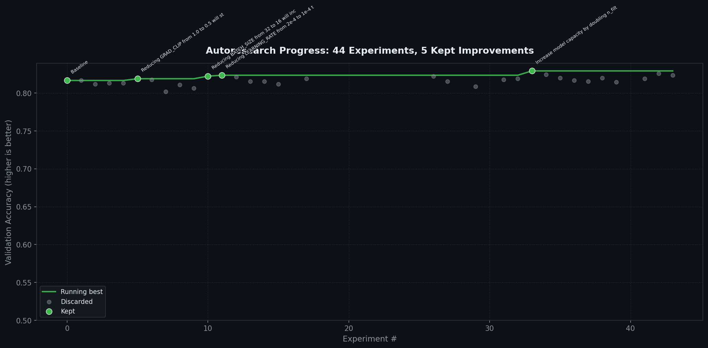

# AutoResearch — Autonomous ML Optimization Using a Team of AI Agents

> A fully autonomous machine learning research system that uses a team of **Claude Opus** AI agents to iteratively optimize neural networks — proposing hypotheses, writing code, validating safety, running experiments, and learning from failures — all with **zero human intervention**.

Inspired by [Andrej Karpathy's vision](https://x.com/karpathy) of AI-driven research loops.



---

## The Problem

Training ML models today is **expensive and slow**. Data scientists spend weeks manually:
- Tweaking hyperparameters (learning rate, batch size, dropout...)
- Testing different architectures (layers, attention heads, model width...)
- Interpreting why experiments fail
- Avoiding repeating the same dead-end experiments

Traditional AutoML tools (grid search, Bayesian optimization, random search) explore parameter spaces **blindly** — they don't reason about *why* something failed or build knowledge across experiments.

**AutoResearch replaces this entire workflow with a team of AI agents that think like researchers.**

---

## Real-World Impact

| Domain | Application |
|--------|-------------|
| **Healthcare** | Optimize diagnostic models (radiology, pathology) under compute/time constraints |
| **Finance** | Auto-tune fraud detection and risk models continuously |
| **NLP/Search** | Improve sentiment analysis, classification, and ranking models autonomously |
| **Startups** | Get ML optimization quality of a large team with zero ML engineers |
| **Research Labs** | Accelerate experiment cycles — run 24/7, learn from every failure instantly |
| **Production ML** | Nightly optimization loops with ratchet-lock guaranteeing no regressions ship |

This system **democratizes ML research** — a solo developer can achieve optimization quality that previously required a team of experienced ML engineers.

---

## How It Works — The PRAR Loop

The system implements a **Perceive → Reason → Act → Reflect** loop that runs autonomously:

```
┌──────────────────────────────────────────────────────────────┐
│                                                              │
│  PERCEIVE  → Read program.md + results.tsv + train.py       │
│      │        (Re-inject goals every iteration — ReCAP)      │
│      ▼                                                       │
│  REASON    → Lead Researcher proposes ONE testable           │
│      │        hypothesis with causal reasoning               │
│      ▼                                                       │
│  ACT       → Code Agent implements surgical edit             │
│      │        → 2-second syntax gate (ast.parse)             │
│      │        → Auditor validates safety constraints         │
│      │        → Up to 3 self-correcting retries              │
│      ▼                                                       │
│  EXECUTE   → Run train.py (strict 300-second budget)         │
│      │                                                       │
│      ▼                                                       │
│  REFLECT   → Accuracy improved?                              │
│               YES → git commit (ratchet-lock best)           │
│               NO  → git revert (discard changes)             │
│               Failed 3x? → Add to FORBIDDEN (never repeat)  │
│                                                              │
│  ──── loop back to PERCEIVE ────                             │
└──────────────────────────────────────────────────────────────┘
```

### Key Design Principles

1. **ReCAP Pattern** — `program.md` (goals, constraints, beliefs) is re-injected into every LLM call to prevent plan drift across long sessions
2. **Ratchet Lock** — Only improvements get committed to git. Best accuracy can only go up, never down
3. **Surgical Edits** — Code Agent outputs `old_snippet → new_snippet` markers, applied via `str.replace`. No full-file rewrites, eliminating LLM truncation bugs
4. **Self-Correcting Audit Loop** — Auditor rejection reasons are fed back to the Code Agent for retry (up to 3 attempts)
5. **Auto-Distillation** — Failed patterns are permanently written to `program.md` as FORBIDDEN rules, creating institutional memory

---

## The AI Agent Team

All 4 agents are powered by **Claude Opus** (Anthropic's most capable model) with extended thinking enabled:

| Agent | Role | What It Does |
|-------|------|-------------|
| **Lead Researcher** | Strategist | Reads all experiment history, proposes exactly ONE hypothesis with causal reasoning ("Because X failed, I conclude Y, therefore changing Z should...") |
| **Code Agent** | Implementer | Translates hypothesis into a surgical code edit using `<<<OLD>>>...<<<NEW>>>...<<<END>>>` markers |
| **Auditor** | Safety Checker | Validates that edits don't break constraints — evaluation function untouched, time limit intact, output format preserved |
| **Belief Distiller** | Memory Manager | After 3+ failures of the same pattern, auto-writes FORBIDDEN rules and synthesizes causal beliefs into `program.md` |

### Agent Interaction Flow

```
Lead Researcher ──hypothesis──→ Code Agent ──edit──→ Auditor
                                    ▲                   │
                                    │    rejection       │
                                    └───feedback─────────┘
                                    (up to 3 retries)

After experiment:
    results.tsv ──→ Belief Distiller ──→ program.md (updated beliefs)
```

---

## The Task — SST-2 Sentiment Classification

**SST-2** (Stanford Sentiment Treebank, binary) is a standard NLP benchmark:
- **Task**: Classify movie review sentences as **positive** or **negative**
- **Dataset**: 67,349 training examples, 872 validation examples
- **Constraint**: Each experiment gets exactly **300 seconds** of compute
- **Metric**: Validation accuracy (higher = better)

### The Model (Agent-Evolved)

The agents started with a Transformer encoder and **autonomously evolved it into a CNN text classifier** for better throughput within the 300s budget:

```
Input Token IDs (batch, seq_len=128)
        │
   Embedding (vocab=8192, d=128)
        │
   Dropout (0.1)
        │
   ┌────┼────┬────┐
   │    │    │    │     Parallel Conv1d
  k=2  k=3  k=4  k=5   (256 filters each)
   │    │    │    │
  ReLU ReLU ReLU ReLU
   │    │    │    │
  Max  Max  Max  Max    Global Max Pooling
   Pool Pool Pool Pool
   │    │    │    │
   └────┴────┴────┘
        │
   Concat (1024-dim)
        │
   Dropout → Linear(1024,256) → ReLU → Dropout → Linear(256,2)
        │
   Logits (positive / negative)
```

### Training Configuration (Agent-Optimized)

| Parameter | Baseline | Final (Agent-Tuned) | Change |
|-----------|----------|---------------------|--------|
| Batch Size | 32 | **16** | Halved → 2x more optimizer steps |
| Learning Rate | 2e-4 | **1e-4** | Halved → matched to smaller batch |
| Gradient Clipping | 1.0 | **0.5** | Tighter → stabilized training |
| Weight Decay | 0.01 | **0.1** | 10x → better regularization |
| AdamW Betas | (0.9, 0.999) | **(0.9, 0.95)** | Less momentum → faster adaptation |
| Warmup Steps | 200 | 200 | Unchanged (reducing hurt accuracy) |
| Dropout | 0.1 | 0.1 | Unchanged (increasing hurt accuracy) |

---

## Results

### Numbers at a Glance

| Metric | Value |
|--------|-------|
| Total experiments run | **42** |
| Experiments that actually trained | **17** |
| Successful improvements (committed) | **5** (including baseline) |
| Code failures (couldn't implement) | **7** |
| Reverted experiments (no improvement) | **12** |
| Baseline accuracy | **81.65%** |
| Best accuracy achieved | **82.34%** |
| Total autonomous improvement | **+0.69%** |
| Compute budget per experiment | **300 seconds** |
| Human intervention required | **Zero** |

### The Causal Chain of Improvements

The system didn't just find good hyperparameters — it discovered they form a **causal chain** where each improvement enables the next:

```
Baseline (81.65%)
    │
    ▼
Iter 7:  GRAD_CLIP 1.0 → 0.5          → 81.88% (+0.23%)
    │    Stabilized gradients
    ▼
Iter 14: BATCH_SIZE 32 → 16           → 82.22% (+0.34%)
    │    2x more optimizer steps (enabled by stable gradients)
    ▼
Iter 19: LEARNING_RATE 2e-4 → 1e-4    → 82.34% (+0.12%)
         Matched LR to smaller batch (only works AFTER batch halving)
```

> **Key Insight**: LR halving was tried earlier (iter 6) and FAILED. It only succeeded after batch halving — proving these form a causal chain, not independent improvements. This is the kind of reasoning traditional AutoML cannot do.

### What Failed (and the System Learned Why)

| Experiment | Result | System's Learned Reason |
|-----------|--------|------------------------|
| N_LAYERS = 3 | 80.50% | Deeper model underfits in 300s — not enough training time |
| D_FF = 512 | 80.62% | Wider FFN overfits / converges slower |
| N_HEADS = 8 | 80.50% | More heads degrades with D_MODEL=128 |
| BATCH_SIZE = 64 | 80.85% | Fewer optimizer steps → worse convergence |
| LR = 3e-4 | 80.50% | Higher LR overshoots the loss landscape |
| DROPOUT = 0.2 | 81.19% | Model is data-limited, not overfitting |
| Cosine LR decay | 81.19% | Wastes scarce compute at near-zero LR |
| Label smoothing 0.1 | 81.31% | Reduces training signal in data-limited regime |
| D_MODEL = 192 | 81.54% | No help — model is data-bottlenecked, not capacity-bottlenecked |
| CLS token pooling | 81.19% | Hurt accuracy vs mean pooling |

### Autonomous Scientific Discoveries

The Belief Distiller synthesized these insights — genuine scientific conclusions, not just parameter logs:

1. **"The model is data/signal-bottlenecked, not capacity-bottlenecked"** — Both increasing AND decreasing model capacity degrades accuracy. The ~82.3% ceiling reflects exhaustion of learnable signal.

2. **"Hyperparameter changes form causal chains"** — Changes succeed only when their prerequisites are in place. LR halving requires batch halving, which requires gradient stabilization.

3. **"Constant post-warmup LR dominates cosine decay under compute constraints"** — With limited training steps, cosine decay wastes too many steps at near-zero LR.

4. **"Label smoothing is harmful in data-limited regimes"** — The model isn't overconfident; it's data-starved. Softening targets reduces the effective signal per example.

---

## Project Structure

```
autoresearch/
├── autoresearch.py      # Main orchestrator — defines all 4 agents + PRAR loop
├── train.py             # Training script — THE ONLY FILE agents can modify
├── prepare.py           # Immutable harness — data loading + locked evaluate()
├── program.md           # Director's brief — goals, beliefs, FORBIDDEN patterns
├── results.tsv          # Complete experiment log (all 42 iterations)
├── plot_progress.py     # Generates progress.png (Karpathy-style dark chart)
├── progress.png         # Visual experiment timeline
├── pyproject.toml       # Dependencies and project config
└── .env                 # Your ANTHROPIC_API_KEY (not tracked in git)
```

### File Roles & Mutability

| File | Who Modifies It | Purpose |
|------|----------------|---------|
| `autoresearch.py` | Human only | Orchestrator — all agent definitions, PRAR loop, git ratchet |
| `train.py` | AI agents only | The mutable training script — agents propose edits here |
| `prepare.py` | Nobody | Immutable harness — prevents "cheating" by locking evaluation |
| `program.md` | Belief Distiller | Persistent memory — auto-updated with beliefs and FORBIDDEN rules |
| `results.tsv` | Auto-appended | Every experiment logged with iteration, hypothesis, accuracy, status |

---

## Tech Stack

| Component | Technology | Purpose |
|-----------|-----------|---------|
| AI Agents | **Claude Opus** (Anthropic API) | Powers all 4 agents with extended thinking |
| ML Framework | **PyTorch** | Model definition and training |
| Dataset | **HuggingFace Datasets** (SST-2/GLUE) | Standard sentiment classification benchmark |
| Tokenizer | **HuggingFace Tokenizers** (BPE) | Custom 8192-vocab BPE trained on corpus |
| Visualization | **Matplotlib** | Karpathy-style dark progress charts |
| Version Control | **Git** | Ratchet-lock (commit improvements, revert failures) |
| Package Manager | **uv** | Fast Python package management |
| Environment | **python-dotenv** | API key management |

---

## Setup & Usage

### Prerequisites

- Python 3.10+
- [uv](https://github.com/astral-sh/uv) package manager
- An `ANTHROPIC_API_KEY` in a `.env` file

### Install & Prepare Data

```bash
# Clone the repo
git clone https://github.com/codeit-ronit/autoresearc-ml-agent.git
cd autoresearc-ml-agent

# Install dependencies
uv sync

# One-time data preparation (downloads SST-2, trains BPE tokenizer)
uv run prepare.py
```

### Run the Autonomous Research Loop

```bash
uv run autoresearch.py
```

This will start the PRAR loop. The system will:
1. Run a baseline experiment
2. Autonomously propose, implement, validate, and test hypotheses
3. Commit improvements, revert failures
4. Auto-update beliefs in `program.md`
5. Stop when accuracy plateaus (<0.1% improvement over 5 consecutive runs)

### Manually Test the Training Script

```bash
uv run train.py
```

### Visualize Progress

```bash
uv run plot_progress.py           # Generate progress.png once
uv run plot_progress.py --watch   # Regenerate every 60 seconds
```

---

## Safety & Integrity Guarantees

The system is designed with multiple safety layers to prevent the AI from "cheating":

| Safety Mechanism | What It Prevents |
|-----------------|------------------|
| **Immutable `prepare.py`** | Agents can't modify the evaluation function to fake improvements |
| **Locked `evaluate()`** | Single source of truth for accuracy — can't be reimplemented |
| **Auditor agent** | Validates every edit against hard constraints before execution |
| **`MAX_TRAIN_TIME = 300`** | Enforced in code — agents cannot change the compute budget |
| **Git ratchet** | Only genuine improvements are committed; failures are auto-reverted |
| **Syntax gate** | `ast.parse` catches broken code in 2 seconds before running |
| **FORBIDDEN patterns** | Auto-learned dead ends are permanently blocked |
| **3-retry limit** | Prevents infinite loops on unimplementable hypotheses |

---

## How This Differs from Traditional AutoML

| Feature | Grid/Random Search | Bayesian Optimization | **AutoResearch** |
|---------|-------------------|----------------------|-----------------|
| Explores parameter space | Exhaustively | Probabilistically | **With causal reasoning** |
| Learns from failures | No | Statistically | **Yes — writes beliefs and FORBIDDEN rules** |
| Chains discoveries | No | No | **Yes — discovers causal dependencies** |
| Modifies architecture | No | No | **Yes — evolved Transformer → CNN** |
| Explains decisions | No | No | **Yes — natural language rationale** |
| Persistent memory | No | Per-session only | **Yes — program.md survives across sessions** |
| Safety guarantees | N/A | N/A | **Auditor + immutable evaluation** |

---

## Inspiration

This project implements the "Karpathy Loop" — the idea that LLMs can act as autonomous researchers, forming hypotheses, running experiments, and building knowledge. Instead of treating hyperparameter optimization as a search problem, AutoResearch treats it as a **scientific reasoning problem**.

---


